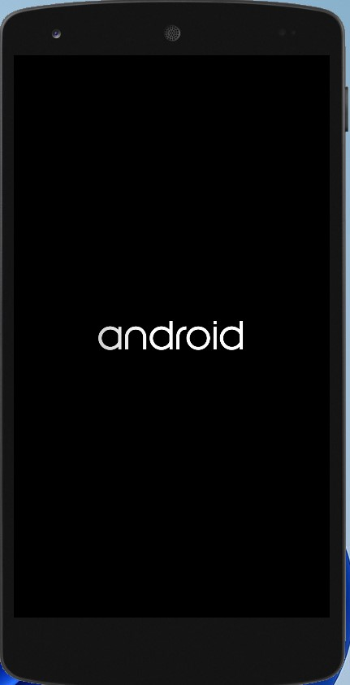
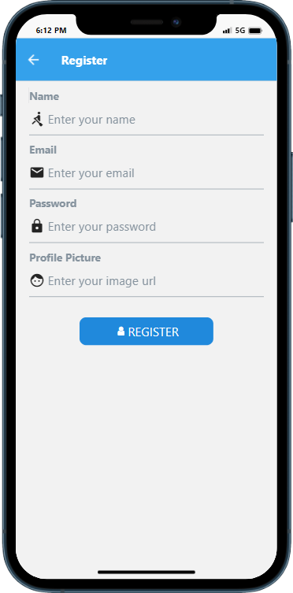
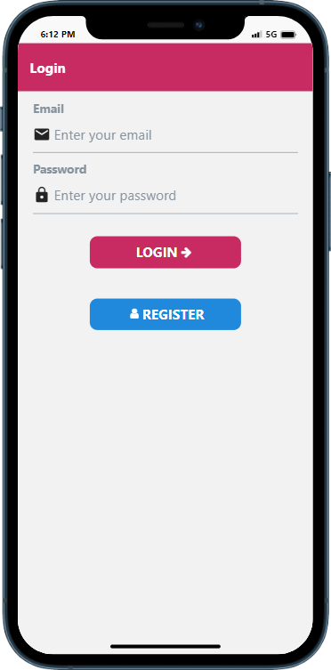

# ✍️React Native App Setp by Step using Expo✍️

# Android Emulator



# Rgister Screen



# Login Screen




### 1. Creating a new application
```
> expo init rn-chat

☑️choose the blank template

> cd rn-chat

````
### 2. Dependencis

````
> npm install react-native-gifted-chat --save

> npm install @react-navigation/native

> expo install react-native-screens react-native-safe-area-context

> npm install @react-navigation/native-stack

> expo install firebase

````

### 3. Start your application

 Open a new terminal inside your React Native project folder. Run the following to Start Metro

````
> npm start
````

## [Source]

### Environment setup: https://reactnative.dev/docs/environment-setup

### Getting Started: https://reactnative.dev/docs/getting-started

### Navigation: https://reactnavigation.org/docs/getting-started

### Component: https://reactnative.dev/docs/components-and-apis

### Elements: https://reactnativeelements.com/docs

### Gifted Chat: https://github.com/FaridSafi/react-native-gifted-chat
